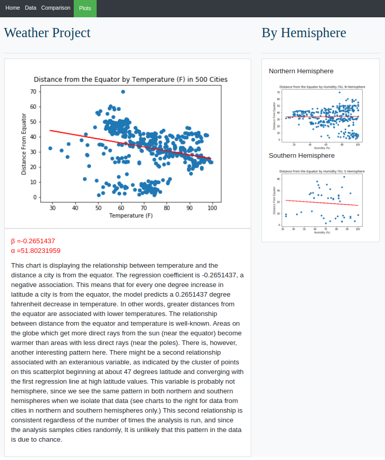
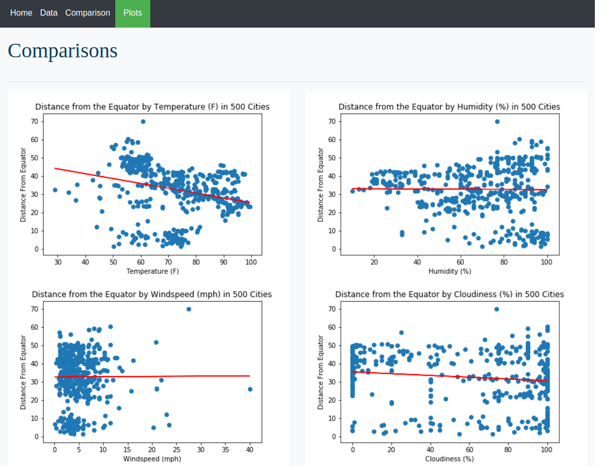
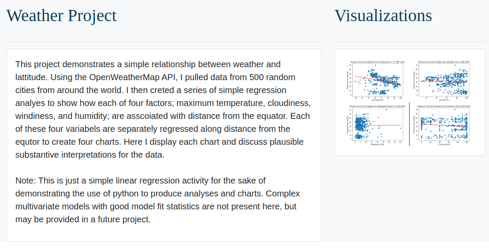

## Summary:

Code for a webpage to display weather data analysis from the python-api project (https://github.com/KathrynPanger/python-api). Webpage shows regression analysis of distance from the equator and a number of weather features. 

## The Files:
```

|+--images -> folder of regression plots used in webpage
|+--static
|   |+--css
|      |+--styles.css -> css style sheet
|+--data.html ->webpage displaying data used in the analysis
|+--humid.html->webpage displaying regression of humidity vs distance
|+--index.html -> home page
|+--styles.css -> css style sheet
|+--temp.html -> webpage displaying regression of temperature vs distance
|+--web.py-> flask app to display web page
|+--wind.html

```

## Examples:

 
 
 


